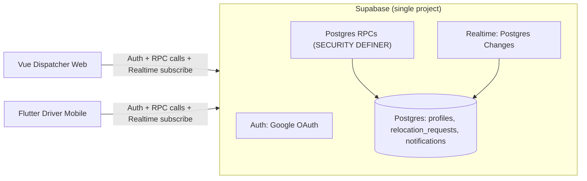
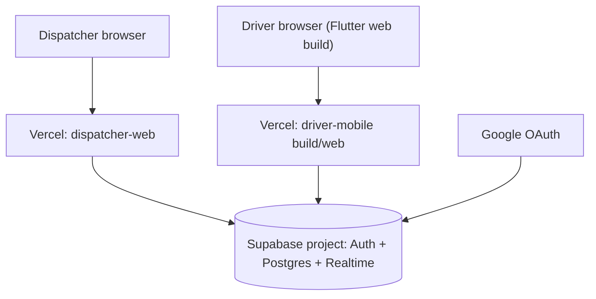
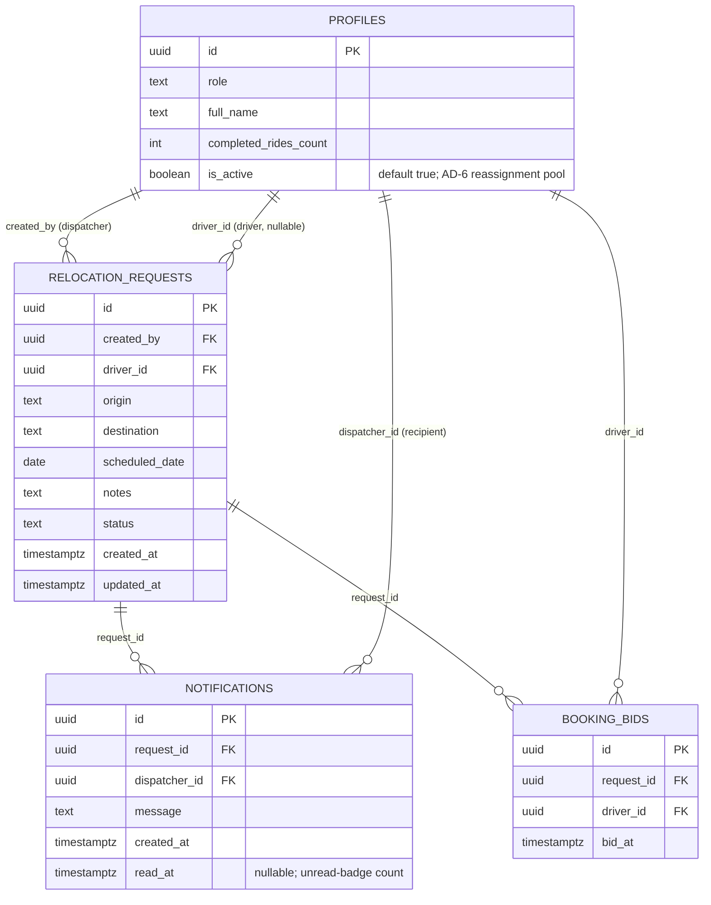

# Architecture Spine — Flovi Relocation-Dispatch

## Design Paradigm

**Postgres-enforced BaaS-direct** (thin clients, fat database) — no custom backend service exists. Both clients are presentation-only: they call Supabase Auth for identity, call a small, fixed set of Postgres RPCs for every state-changing action, and subscribe to Postgres Changes for realtime sync. Every rule shared across both apps — role assignment, the state machine, the completed-rides priority tie-break, auto-reassignment, notification creation — lives exactly once, in Postgres (SQL functions + triggers), never duplicated in Dart or JS.

Maps to namespaces: `apps/dispatcher-web` and `apps/driver-mobile` are pure presentation layers (zero domain logic); `supabase/functions.sql` + `supabase/policies.sql` are the entire domain/authorization layer; `supabase/migrations` is persistence. Neither app depends on the other, directly or via a private API — both depend only on Supabase.



## Invariants & Rules

### AD-1 — Postgres-enforced BaaS-direct, no custom backend

- **Binds:** all
- **Prevents:** the two clients re-implementing (and inevitably diverging on) shared business rules; a client bypassing a rule because it only exists in the other app's code
- **Rule:** [ADOPTED] Neither app has its own backend service. Both talk directly to Supabase — `@supabase/supabase-js` (Vue) / `supabase_flutter` (Flutter). Any behavior that must be identical across both apps is implemented once, in Postgres, and both clients call the same function or read the same table — never two client-side implementations of one rule.

### AD-2 — Role assignment is a fixed claim-role RPC call, immutable after first write

- **Binds:** CAP-1, CAP-5
- **Prevents:** the two apps inventing different signup/role mechanisms; a role being flippable by signing into the other app later; one person silently holding both roles
- **Rule:** Each app calls exactly one fixed RPC argument immediately after its first OAuth callback: dispatcher-web always calls `claim_role('dispatcher')`; driver-mobile always calls `claim_role('driver')`. `claim_role` is `SECURITY DEFINER`. On first call it inserts the caller's `profiles` row, setting `role` to the argument and `full_name` from the OAuth identity's provider metadata (Google's `full_name`/`name` claim off `auth.users.raw_user_meta_data`). If a `profiles` row already exists for that user with a **different** role than requested, `claim_role` raises an exception rather than flipping or dual-holding the role — one person is exactly one role, permanently. `profiles.role` has no client-facing UPDATE path once set.

### AD-3 — Single write path for every state transition, self-checked at the RPC

- **Binds:** CAP-7, CAP-10, CAP-11, CAP-12, CAP-14
- **Prevents:** a client bypassing the priority rule or the state machine by writing `status`/`driver_id` directly, at INSERT or UPDATE; the two apps drifting on how a transition is validated; an RPC silently trusting its caller because it runs as `SECURITY DEFINER`
- **Rule:** `relocation_requests.status` and `.driver_id` have no client-facing UPDATE grant. On INSERT (CAP-2), a trigger forces `status = 'unbooked'` and `driver_id = NULL` regardless of what the client supplies — a client cannot create a request pre-booked to an arbitrary driver. All transitions after that go through four `SECURITY DEFINER` RPCs — `book_request(request_id)`, `cancel_request_dispatcher(request_id)`, `cancel_request_driver(request_id)`, `complete_request(request_id)`. Because `SECURITY DEFINER` bypasses the caller's RLS, **each RPC's first statement independently verifies the caller** via `auth.uid()` against the caller's own `profiles.role` and, where relevant, the target row's `created_by`/`driver_id` — `book_request`/`cancel_request_driver`/`complete_request` require the caller's role to be `driver` (and, for cancel/complete, that `driver_id = auth.uid()`); `cancel_request_dispatcher` requires role `dispatcher` and `created_by = auth.uid()`. A failed check raises an exception; the transaction never proceeds on trust alone. Each RPC also enforces `state-machines.md`'s transition table (including: `state-machines.md`'s table has no explicit `completed → cancelled` row, but CAP-10's text — "at any time, regardless of its current status" — governs, so `cancel_request_dispatcher` permits cancelling from any non-`cancelled` status, including `completed`) and performs its priority-rule check (AD-6, AD-7) in the same transaction as its write.

### AD-4 — Dispatcher visibility and mutation are owner-scoped, never a shared pool

- **Binds:** CAP-2, CAP-3, CAP-4, CAP-10, CAP-13
- **Prevents:** cross-dispatcher read/write leakage; a shared-pool implementation that contradicts CAP-13's own wording; the two RLS policies below silently OR-combining into a leak (Postgres OR's *all* permissive policies for a table/command — an un-role-gated driver-visibility policy would expose every dispatcher's unbooked rows to every other dispatcher too, exactly resurrecting the pool this AD exists to prevent).
- **Rule:** [ADOPTED, from user correction] A dispatcher may view, edit, or cancel only the `relocation_requests` rows they created — never another dispatcher's. Both RLS policies on `relocation_requests` are **role-gated**, not just predicate-gated: `dispatcher_own` — `USING ((SELECT role FROM profiles WHERE id = auth.uid()) = 'dispatcher' AND created_by = auth.uid())`; `driver_visibility` — `USING ((SELECT role FROM profiles WHERE id = auth.uid()) = 'driver' AND (status = 'unbooked' OR driver_id = auth.uid()))`. The role check is what stops the two permissive policies from OR-combining across roles. `created_by` defaults server-side to `auth.uid()` and is never client-supplied. The `notifications` row for a given request is scoped the same way: `USING (dispatcher_id = auth.uid())`, `dispatcher_id` set server-side to the request's `created_by` at write time. `profiles` itself has an open SELECT policy (`USING (true)`) for authenticated users — every user needs to resolve `id`/`role`/`full_name`/`completed_rides_count` for names and status displays across both apps; only `role` and `completed_rides_count` are write-locked (AD-2, AD-6). (Reconciles CAP-3's "views all relocation requests" with CAP-13's "notified... for one of *their* requests" — both read as scoped to the dispatcher's own requests.)
- **Does not affect:** driver-side visibility, which stays global via the role-gated `driver_visibility` policy above — since CAP-6/CAP-8 carry no per-dispatcher scoping.

### AD-5 — One realtime contract, one shared vocabulary

- **Binds:** CAP-3, CAP-6, CAP-8, CAP-9, CAP-13
- **Prevents:** the two apps subscribing to different tables, column names, or status spellings and silently drifting out of sync
- **Rule:** Both apps subscribe to Postgres Changes on exactly two tables — `relocation_requests` and `notifications` — using the identical column names and the four-value `status` enum (`unbooked` / `booked` / `completed` / `cancelled`, lowercase, no aliases) fixed in Structural Seed. Each app performs one initial `SELECT` to hydrate its list on load (and on realtime reconnect) — Postgres Changes never replays pre-existing rows, so this initial read is part of the sync path, not a forbidden "polling fallback." Visibility on both the initial `SELECT` and the realtime stream comes from the same RLS policies (AD-4) — Supabase Realtime authorizes each change against the subscriber's RLS, so a driver's "unbooked OR own" visibility (which can't be expressed as a single equality `filter=` parameter) is enforced correctly without either app needing to hand-roll client-side filtering. No app-local derived-state cache beyond that, and no polling as a *substitute* for realtime.

### AD-6 — Completed-rides increment and every priority read happen inside the deciding transaction; concurrent bookings resolve by a short bid window, not lock order

- **Binds:** CAP-7, CAP-12, CAP-14
- **Prevents:** a stale-read race where a priority evaluation uses a `completed_rides_count` that changed between read and write; the CAP-7 tie-break silently degrading into "whichever caller's transaction happened to acquire the row lock first wins" — which is a *different* rule than "highest completed-rides wins" and would violate CAP-7's explicit success criterion
- **Rule:** `profiles.completed_rides_count` is incremented only inside `complete_request`'s transaction. `book_request(request_id)` does **not** decide the instant it acquires the row: it (1) inserts the caller's attempt into a short-lived `booking_bids(request_id, driver_id, bid_at)` table (cheap, non-blocking insert — concurrent bidders never contend with each other here); (2) waits a short fixed window (~300ms) so genuinely-concurrent bids can land; (3) takes `SELECT ... FOR UPDATE` on the `relocation_requests` row; (4) if `status` is still `unbooked`, reads all bids for this request within the window and assigns the one with the highest `completed_rides_count` (earliest `bid_at` breaks an exact tie) — this is the one DB-level moment CAP-7's rule is actually evaluated; (5) every bidder's RPC call returns whether *it* was the assigned winner, so the UX's "no longer available" treatment (EXPERIENCE.md) is driven by the RPC's own return value, not a client-side guess. `cancel_request_driver`'s reassignment search (CAP-12) uses the same completed-rides-ranked read, but without a bid window — it just ranks the currently-active driver pool (`profiles.is_active`, Structural Seed) by `completed_rides_count DESC`, excluding the cancelling driver, inside its own locked transaction, since there's no competing bid to wait for. Every priority read happens inside the same transaction that performs the resulting `status`/`driver_id` write.

### AD-7 — One canonical 24-hour-cutoff formula, computed identically on both sides

- **Binds:** CAP-11, CAP-12
- **Prevents:** the Vue and Flutter clients each hand-rolling their own date math for the proactive disabled-Cancel-button state (EXPERIENCE.md's Booked-gig row) and landing on different answers near the boundary, or disagreeing with the server's own enforcement inside `cancel_request_driver`
- **Rule:** `relocation_requests.scheduled_date` is a `date` (no time-of-day, per SPEC.md/EXPERIENCE.md — no time field exists anywhere in the New/Edit Request modal). The cutoff instant is defined once as `scheduled_date` at `00:00 UTC`, minus 24 hours: `cutoff := (scheduled_date::timestamptz AT TIME ZONE 'UTC') - interval '24 hours'`. A cancellation is blocked when `now() >= cutoff`. Both clients compute the Booked-gig row's disabled/muted state client-side using this exact formula (for instant UI feedback, no round trip) — but `cancel_request_driver` re-checks the identical formula server-side as the authoritative guard, since the client-side check is a UX convenience, never the enforcement.

## Consistency Conventions

| Concern | Convention |
| --- | --- |
| Naming (entities, files, interfaces, events) | snake_case Postgres identifiers. RPC verbs fixed: `claim_role`, `book_request`, `cancel_request_dispatcher`, `cancel_request_driver`, `complete_request`. Status enum fixed: `unbooked` / `booked` / `completed` / `cancelled`. |
| Data & formats (ids, dates, error shapes, envelopes) | `uuid` ids (`gen_random_uuid()` default). `scheduled_date` is a `date` (no time-of-day). Timestamps are `timestamptz`, ISO 8601 over the wire (Supabase/PostgREST default) — no bespoke envelope. RPC failures raise a Postgres exception whose message the client maps 1:1 to `EXPERIENCE.md`'s fixed banner/inline copy (e.g. "Too close to the ride to cancel (within 24h)."), never a per-app custom error shape. |
| State & cross-cutting (mutation, errors, logging, config, auth) | All mutation goes through the 5 RPCs (AD-1/AD-3). RLS is the authorization layer for every direct table read/write; it is **not** sufficient on its own for the RPCs, since `SECURITY DEFINER` bypasses RLS by design — each RPC additionally performs its own `auth.uid()`-based check (AD-3) as a first-class part of the same rule, not a separate layer to duplicate elsewhere in app code. Supabase Auth (Google OAuth, one client, `AuthFlowType.pkce` on both clients) is the single identity provider for both apps, each with its own fixed `/auth/callback` route — Flutter web's default hash-based routing collides with an implicit-flow OAuth redirect, which PKCE plus a dedicated callback route avoids. Repo layout is **one monorepo**, not two separate repos — SPEC.md's constraint is "a publicly visible repository" (singular). |

## Stack

| Name | Version |
| --- | --- |
| Vue | ^3.5 (current stable line; 3.6 is beta, not used) |
| Vite | ^8.1 |
| Tailwind CSS | ^4.3 |
| Flutter | 3.44 (stable channel) |
| @supabase/supabase-js | ^2.110 |
| supabase_flutter | ^2.12 |
| Supabase | hosted platform, single project (Postgres + Auth + Realtime) |
| Hosting | Vercel (both the Vue build and the Flutter `build/web` static output) |

## Structural Seed

### Deployment & environments

Single Supabase project, no staging/prod split (demo scope, per challenge constraints). One Google OAuth client in Supabase Auth with both apps' URLs allow-listed as redirect URLs. The Supabase anon key is safe to bake into both client bundles (RLS-protected); the service-role key is never used client-side. Both clients use `AuthFlowType.pkce` with a dedicated `/auth/callback` route (not the SPA root) — Flutter web's default hash-based router and an implicit-flow OAuth redirect both want the URL fragment, a documented collision; PKCE's query-param code exchange plus a fixed route sidesteps it for both apps identically.



### Core entities



### Source tree

```text
flovi/                        # one monorepo, one public GitHub/GitLab repo
  apps/
    dispatcher-web/            # Vue 3 + Vite + Tailwind
      src/
        views/                 # Requests, Notifications, Login
        components/            # RequestCard, StatusPill, RequestModal, FilterChips, StatTile
        lib/supabase.ts         # single client init
        composables/            # useRequests (realtime sub), useAuth
    driver-mobile/              # Flutter 3, web build target for the demo
      lib/
        screens/                 # gigs, booked, profile, login, booking_confirmation
        widgets/                  # gig_card, status_pill, booked_gig_row
        services/                  # supabase_client.dart, requests_service.dart (realtime sub)
  supabase/
    migrations/                    # schema: profiles, relocation_requests, notifications
    functions.sql                   # claim_role, book_request, cancel_request_dispatcher,
                                     # cancel_request_driver, complete_request
    policies.sql                     # RLS policies (AD-4)
    seed.sql                          # demo dispatcher/driver accounts
```

## Capability → Architecture Map

| Capability | Lives in | Governed by |
| --- | --- | --- |
| CAP-1 | dispatcher-web Login + `claim_role` RPC | AD-2 |
| CAP-2 | dispatcher-web Requests (create) → `relocation_requests` INSERT | AD-1, AD-4 |
| CAP-3 | dispatcher-web Requests (list) + Realtime subscribe | AD-4, AD-5 |
| CAP-4 | dispatcher-web Requests (edit) → RLS-gated UPDATE (non-status columns) | AD-4 |
| CAP-5 | driver-mobile Login + `claim_role` RPC | AD-2 |
| CAP-6 | driver-mobile Gigs + Realtime subscribe | AD-5 |
| CAP-7 | `book_request` RPC | AD-1, AD-3, AD-6 |
| CAP-8 | driver-mobile Booked | AD-5 |
| CAP-9 | Realtime subscriptions, both apps | AD-5 |
| CAP-10 | `cancel_request_dispatcher` RPC | AD-3, AD-4 |
| CAP-11 | `cancel_request_driver` RPC (24h guard) | AD-3, AD-7 |
| CAP-12 | `cancel_request_driver` RPC (reassignment branch) | AD-3, AD-6 |
| CAP-13 | `notifications` table + Realtime | AD-4, AD-5 |
| CAP-14 | `complete_request` RPC | AD-3, AD-6 |

## Deferred

- **CI/CD automation** — manual deploy to Vercel is acceptable inside the 4-hour cap; revisit only if this ever moves past a demo.
- **Observability/logging/monitoring** — explicitly out of scope; `challenge-context.md` grades the operator, not operational maturity.
- **Multi-environment (staging) split** — one Supabase project is sufficient at demo scope.
- **Rate limiting / abuse protection on RPCs** — acceptable risk for a scoped demo with seeded accounts, not a public-facing product.
- **Automated test suite** — explicitly a non-goal per SPEC.md Constraints/Non-goals.
- **Push notifications (OS-level)** — CAP-13 is in-app only, dispatcher-side; no cross-device push needed.
- **Driver active/inactive toggle UI** — `profiles.is_active` exists in schema (AD-6's reassignment pool needs it) but no capability specifies a UI to flip it; all seeded drivers default `true`, which is sufficient for the demo.
- **Notification "read" trigger** — EXPERIENCE.md specifies an unread-count badge but not what marks an item read; `notifications.read_at` exists to support it, but the exact trigger (e.g. opening the Notifications page marks all visible unread items read) is an implementation detail left to build time, not an architectural invariant.
